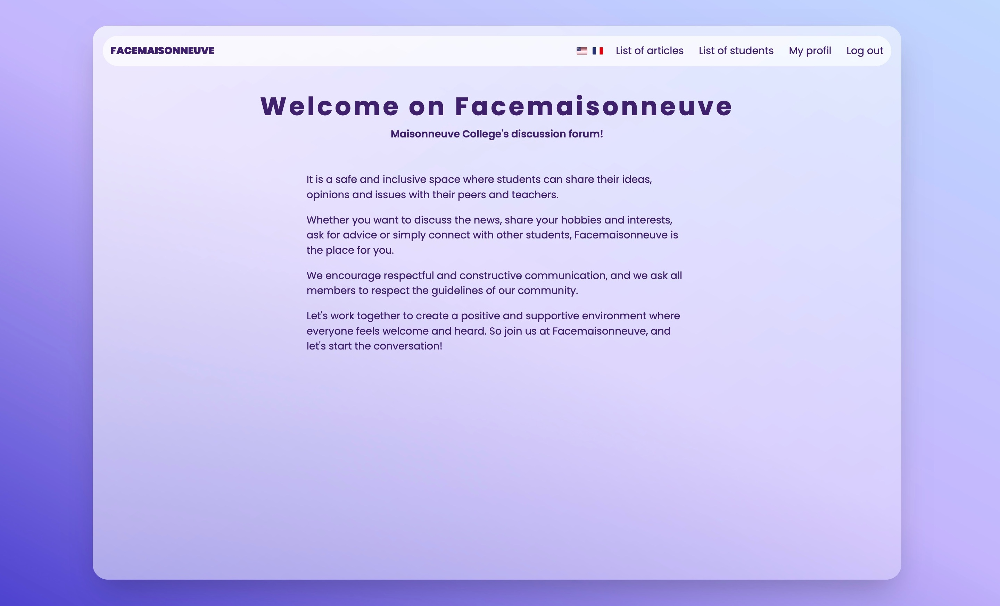
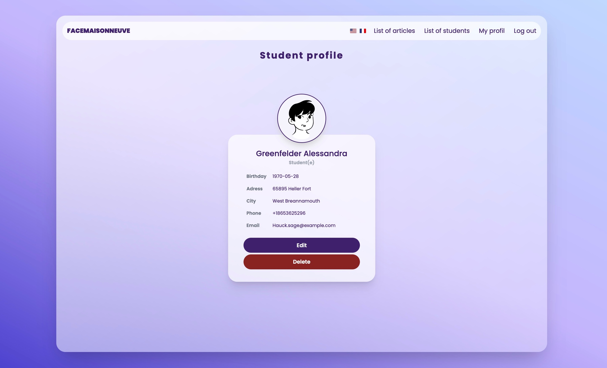
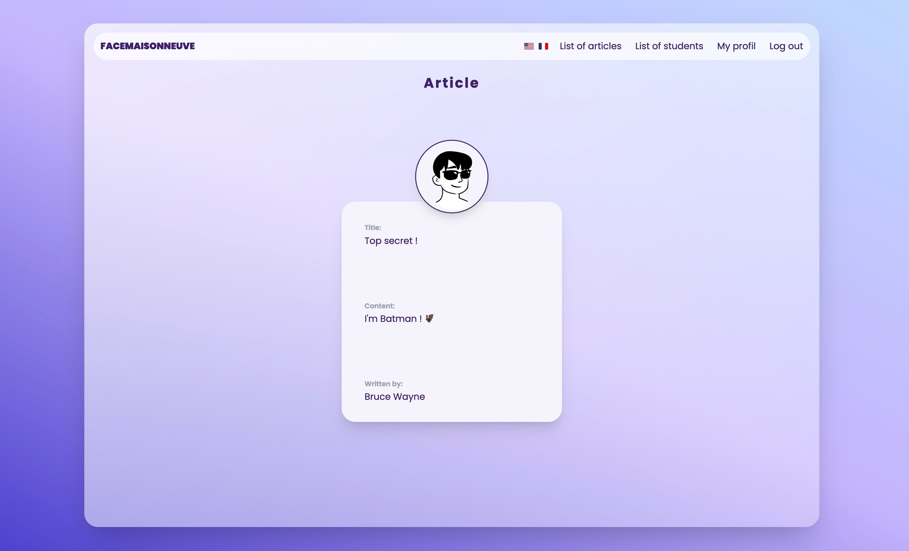

# TP1 - Laravel

Pour ce projet, nous devons concevoir un site web dynamique multilingue avec des profils fictifs et la possibilité de publier des articles en utilisant le framework Laravel.

### Contraintes

-   Créer le nouveau projet, les modèles, les tables et les contrôleurs en utilisant la ligne de commande.
-   Générer 15 villes, 100 étudiants et 10 articles en utilisant Faker Factory et en ligne de commande.
-   Personnaliser le CSS en utilisant Tailwind CSS.
-   Créer un layout.blade réutilisable.
-   Implémenter les méthodes pour afficher, créer, modifier et supprimer un étudiant et/ou article (index, create, show, edit et destroy).
-   Créer une page de connexion avec un mot de passe crypté.
-   Mettre en place un système multilingue.

### Autres

Les images de profils des étudiants sont générés par https://www.dicebear.com/styles/lorelei

#TP1 - Laravel

For this project, we need to design a multilingual dynamic website with fictitious profiles and the possibility to publish articles using the Laravel framework.

### Constraints

-   Create the new project, models, tables and controllers using the command line.
-   Generate 15 cities, 100 students and 10 articles using Faker Factory and command line.
-   Customize CSS using Tailwind CSS.
-   Create a reusable layout.blade.
-   Implement the methods to display, create, modify and delete a student and/or article (index, create, show, edit and destroy).
-   Create a login page with an encrypted password.
-   Set up a multilingual system.

### Others

Student profile pictures are generated by https://www.dicebear.com/styles/lorelei

