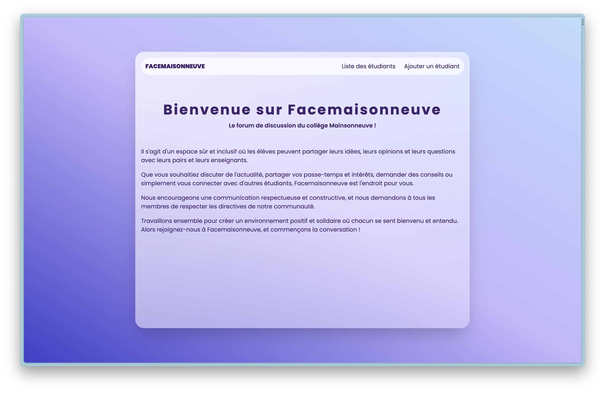
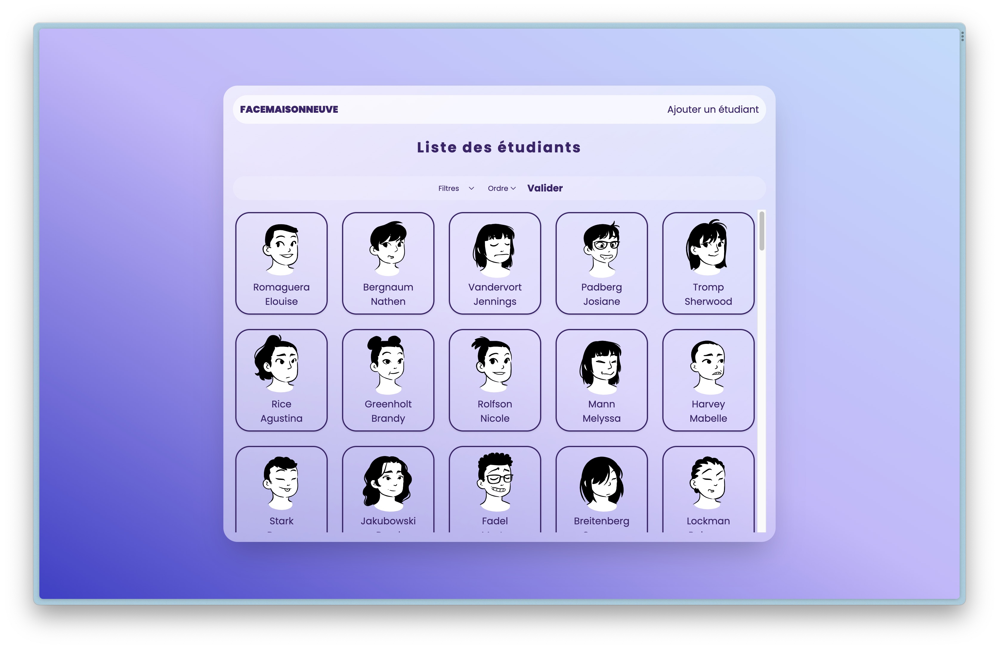
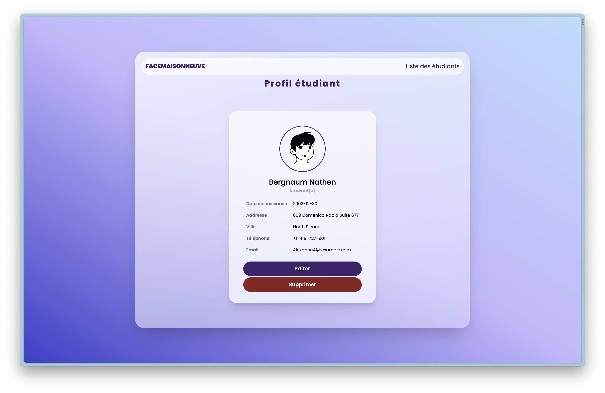

# TP1 - Laravel

Pour ce projet, il nous est demander un site web dynamique avec les profils fictifs en utilisant le cadriciel Laravel.

## Les contraintes

-   En ligne de commande, créer un nouveau projet, créer deux modèles, créer deux tables, créer deux contrôleurs
-   En ligne de commande, créer 15 villes et 100 étudiants à l'aide de Faker Factroy
    https://github.com/fzaninotto/Faker
-   Créer un CSS personnaliser (Tailwind CSS)
-   Créer un layou.blade
-   Créer les méthodes pour pouvoir afficher, créer, modifier et supprimer un étudiant
    (index, create, show, edit et destroy)

### Autres

Les images de profils des étudiants sont générés par https://www.dicebear.com/styles/lorelei

#TP1 - Laravel

For this project, we are asked for a dynamic website with fictitious profiles using the Laravel framework.

## Constraints

-   In command line, create a new project, create two models, create two tables, create two controllers
-   In command line, create 15 cities and 100 students using Faker Factroy
    https://github.com/fzaninotto/Faker
-   Create custom CSS (Tailwind CSS)
-   Create a layou.blade
-   Create the methods to be able to display, create, modify and delete a student
    (index, create, display, edit and destroy)

### Others

Student profile pictures are generated by https://www.dicebear.com/styles/lorelei

